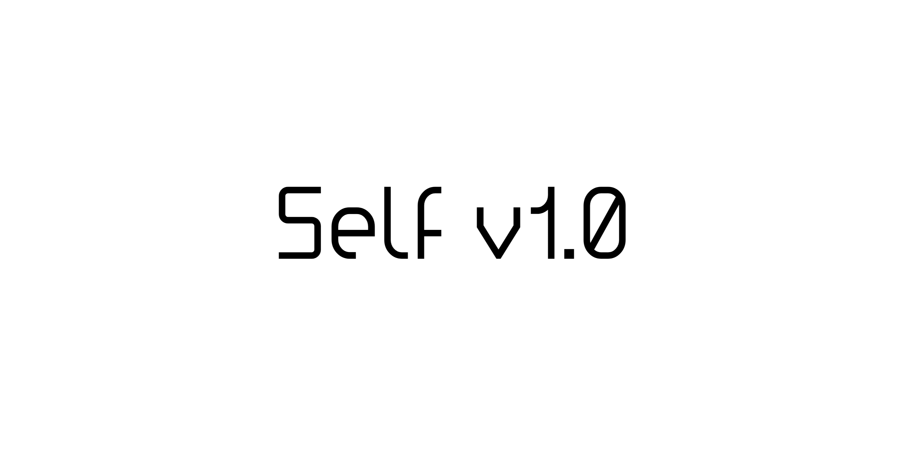

# Age-based Versioning v1.0 Documentation

> IMPORTANT NOTE: Because this documentation was translated from Indonesian to US English with less suitable tools and done quickly, there may be many errors in writing and grammar. Therefore, as the creator, I ask if anyone wants to help rewrite the documentation using the correct language rules for the convenience of the readers. If anyone is willing, please open a pull request in this repository on the main branch or please get in touch with me via email at farhnkrnapratma@gmail.com or contact me via WhatsApp at +62 853 7710 2721 or Telegram @farhnkrnapratma.

## Introduction

Age-based versioning is a versioning that is determined based on the age of "something" (that it has been versioned with it) where it will continue to increase incrementally every 1 month.

## Read or Download the Documentation

You can read the full documentation [here](./docs/selv-docs_v1.0.pdf) or download the documentation [here](https://github.com/farhnkrnapratma/selfv/releases/tag/v1.0).

---

© 2025 "Age Based Versioning" by Farhan Kurnia Pratama, licensed under the Creative Commons Attribution-ShareAlike 4.0 International License.
(https://creativecommons.org/licenses/by-sa/4.0/)
